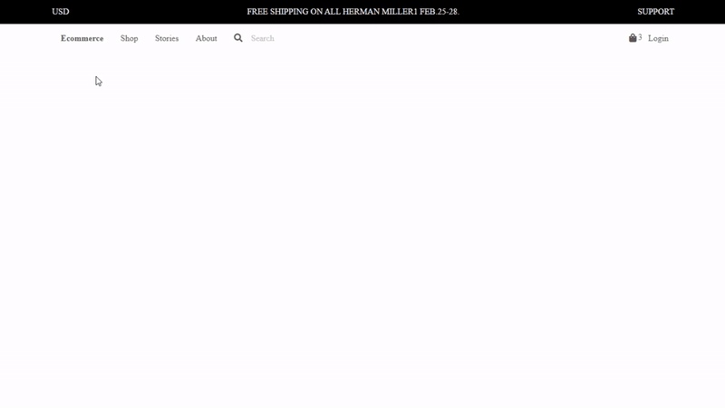

# Ecommerce Webframe Kit

This repo has been cloned pixel-perfect from figma. You can access the site at this [address](https://www.figma.com/file/ChuXtQjOxVUAC2qLDvAMb5/Ecommerce-Wireframe-Kit-(Community)?node-id=0%3A1) .

The site, which was created using only html and css, has 1 main css file and html files consisting of 15 sections.
## These:
**main.css** file holding all style files.
**index.html** creates the header part of the site.
**hero01.html** and **hero02.html** form the hero part of the site.
**shop01.html** and **shop02.html** form the shop part of the site.
**product01.html** and **product02.html** form the product information part of the site.
**cart.html** section creates the section on the site where card information can be entered.
**checkout-addrees.html** , **checkout-payment.html** , **checkout-shipping.html** sections form the section on the site that contains the users' address information, payment information, and order taking information.
**login.html** and **login-email.html** parts create the login part of the users to the site.
**reviews.html** section creates the section where the site is evaluated by users.
**footer.html** section contains the lowest section information of the site.

## Authors
* **Rabia Uğurlu** - [rabiaugurlu](https://github.com/rabiaugurlu)
## License
This project is licensed under the MIT License - see the [LICENSE.md](LICENSE.md) file for details
